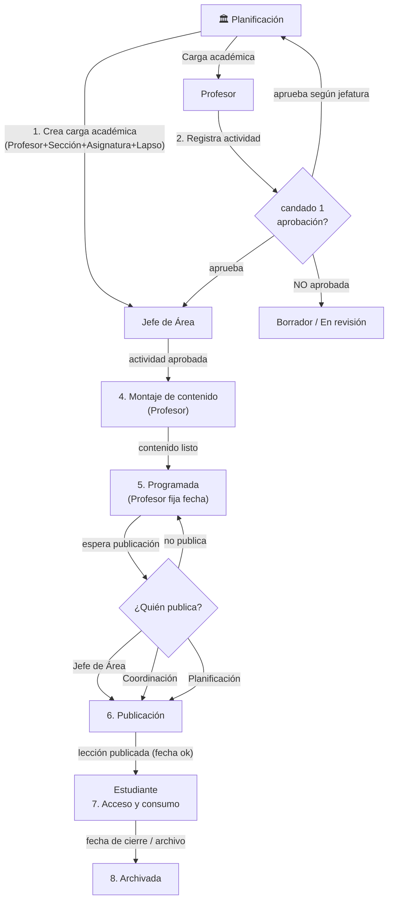

# Diagrama de Actores — Flujo Activity-Lesson (enfoque Planning)

**Versión:** 0.1
**Autor:** Codex / Agent Workspace
**Fecha:** 2026-08-06
**Estado:** Estructura markdown propuesta (borrador para construir la siguiente infografía).
**Relación:** Complementa `blueprint/flow/modulo-flow-as-is.md` y la infografía existente `docs/infografia/flujoActivityLesson.html`.

---

## 1. Propósito

Generar un **diagrama de actores** del proceso **activity-lesson** con enfoque en los **casos de uso de Planificación** dentro del ecosistema LMS/SAEFL. El objetivo es partir del análisis de la infografía y los specs existentes (`blueprint/lesson/RulesStatusLesson.md`, `blueprint/lesson/Spec LMS - Completions and Extensions.md`, `blueprint/lesson/docWizardLesson.md`, `blueprint/planning/inscripcions.md`) para producir una estructura reusable que sirva de base a la infografía HTML/visual de los casos de uso de Planning en cada etapa de la actividad.

---

## 2. Actores del Ecosistema (según infografía actual)

| # | Actor | Rol general en el flujo | Intervención de Planificación |
|---|-------|--------------------------|-------------------------------|
| 1 | **Planificación** | Crea la carga académica (ancla Profesor + Sección + Asignatura + Lapso); puede aprobar actividades y publicar lecciones. | **Participación activa** — responsable del paso 1 (carga), participa en la aprobación (paso 3) y en la publicación (paso 6). |
| 2 | **Profesor** | Registra la actividad, monta el contenido y programa la lección (no la publica). | Recepciona la carga académica que creó Planificación; genera las actividades que Planificación puede aprobar según jefatura. |
| 3 | **Jefe de Área** | Aprueba actividades y publica lecciones programadas, según su jefatura. | Comparte responsabilidad de aprobación (Candado 1) y publicación (paso 6). |
| 4 | **Coordinación** | Supervisa y publica lecciones programadas de sus planes educativos asociados. Puede aprobar actividades. | Puede actuar como responsable de publicación si el ámbito lo permite; recibe visibilidad de la carga académica. |
| 5 | **Estudiante** | Consulta, consume y progresa. | Destinatario final; solo ve lecciones de su propia sección y que cumplan los 6 candados. |

---

## 3. Viaje de la Lección con enfoque en Planning

### 3.1 Casos de uso de Planning (según specs y lógica LMS)

| # | Caso de uso | Origen en specs | Impacto en el flujo |
|---|-------------|------------------|----------------------|
| 1 | **Carga académica** | Jerarquía `Pestudio → Pensum → Pevaluacion → Activity`; Planning administra el CRUD de cargas. | Sin este caso no existe la actividad. |
| 2 | **Aprobación de la actividad** | Infografía: Jefe de Área o Planning aprueban la actividad (Candado 1). | Sin aprobación la actividad es invisible. |
| 3 | **Programación / publicación** | `docWizardLesson.md`: "Los planificadores pueden publicar directamente o programar una fecha; los profesores programan y Planning revisa/publica". | Convierte una lección programada en visible. |
| 4 | **Monitor de coordinador** | `Spec LMS` / `Spec LMS - Completions`: `LmsMonitor` (con filtro por estado). | Facilita la supervisión de publicaciones LMS. |
| 5 | **Auditoría de actividad** | `Spec LMS - Completions`: `ActivityAudit` (logs por actividad, eventos, fechas). | Permite revisar visitas, descargas y eventos de una actividad. |

### 3.2 Viaje de la lección con enfoque en Planning

Los números corresponden a los 8 pasos de la infografía actual.

| Paso | Etapa | Actor principal | Rol de **Planning** |
|------|-------|-----------------|---------------------|
| 1 | **Asignación de Carga** | Planificación | **Crea la carga académica** (Profesor + Sección + Asignatura + Lapso). Sin este paso, el profesor no tiene dónde registrar la actividad. |
| 2 | **Registro de Actividad** | Profesor | Observa/monitorea que las cargas asignadas generen actividades; no interviene directamente. |
| 3 | **Aprobación Académica (Candado 1)** | Jefe de Área / Planificación | **Aprueba la actividad según su jefatura** junto con el Jefe de Área. Sin aprobación, la actividad es invisible. |
| 4 | **Montaje del Contenido** | Profesor | No interviene directamente; puede supervisar avances. |
| 5 | **Programación** | Profesor | Monitoriza que existan lecciones programadas; puede aprovechar el estado **Programada** para auditar contenido antes de la publicación. |
| 6 | **Publicación** | Jefe de Área / Coordinación / Planificación | **Puede publicar** la lección programada. Es decisión de un responsable; el sistema nunca publica solo. |
| 7 | **Acceso y Consumo** | Estudiante | Verifica cobertura curricular y seguimiento de consumo desde la supervisión. |
| 8 | **Expiración / Archivo** | Sistema / manual | Puede archivar; audita lecciones que expiraron para ver el cierre del ciclo. |

---

## 4. Interacciones clave de Planificación con cada actor

### 4.1 Planning → Profesor
- **Asigna la carga académica** que habilita al profesor a registrar actividades.
- **Supervisa** el avance docente (borradores, programadas vs publicadas).
- **Puede aprobar** actividades cuando la jefatura lo delega.

### 4.2 Planning → Jefe de Área
- Comparten la **aprobación** de actividades (Candado 1).
- Comparten la **publicación** de lecciones programadas.
- Planning puede actuar cuando el Jefe de Área no cubre determinada jefatura o ámbito.

### 4.3 Planning → Coordinación
- Coordinación supervisa sus planes educativos y publica según su ámbito.
- Planning mantiene la coherencia de **carga académica** que sustenta todo el plan educativo.

### 4.4 Planning ↔ Estudiante (indirecto)
- Planning no interactúa con el estudiante directamente, pero su **carga académica** + **aprobaciones** + **publicaciones** determinan qué lecciones llegan al estudiante.

---

## 5. Estados relevantes y candados en los que Planning tiene incidencia

Según `blueprint/lesson/RulesStatusLesson.md` y la infografía, los estados del ciclo de vida son:

```
Borrador ──┬──→ Publicado ──→ Archivado
           └──→ Programado ──→ Publicado (según infografía: lo publica un responsable)
```

| Estado | ¿Qué ve el estudiante? | ¿Planning interviene? |
|--------|------------------------|------------------------|
| `DRAFT` (Borrador) | No visible | Puede supervisar el avance. |
| `SCHEDULED` (Programada) | No visible | Puede auditar antes de que se publique; aquí la **publicación** es el paso siguiente. |
| `PUBLISHED` (Publicada) | Visible (Vista Previa o Completa según fecha) | **Puede haber sido publicada por Planning** (paso 6). |
| `ARCHIVED` (Archivada) | Ya no disponible | Puede archivar o verificar el cierre del ciclo. |

### Candados de visibilidad donde Planning participa

| Candado | Descripción | Rol de Planning |
|---------|-------------|-----------------|
| **1 — Aprobación** | La actividad fue aprobada por Jefe de Área o Planificación. | **Sí** — puede ser el aprobador. |
| **2 — Contenido Visible** | Elementos de la lección marcados visibles. | No, lo configura el profesor. |
| **3 — Publicada** | Lección publicada por Jefe de Área, Coordinación o Planificación. | **Sí** — puede ser el publicador. |
| **4 — Fecha de Publicación** | Tiene fecha definida (Vista Previa / Completa). | Puede verificar coherencia con cronograma. |
| **5 — No ha Expirado** | No llegó la fecha de cierre. | Puede supervisar. |
| **6 — Es de su Sección** | Pertenece a la sección del estudiante. | Deriva de la carga académica que Planning creó. |

---

## 6. Diagrama Mermaid propuesto

> Borrador para la futura infografía. Se puede reutilizar en diferentes variantes (solo actores, actor-paso, actor-estado).



---

## 7. Propuesta de estructura para la futura infografía visual

Sugerencia de secciones para el HTML/infografía del diagrama de actores *Planning*:

1. **Hero**: título "Planificación en el Flujo Actividad / Lección" + estado actual revisado.
2. **Grid de los 5 actores** (misma estética de la infografía madre), con **Planning destacado**.
3. **Viaje de la lección**: 8 pasos en línea de tiempo, con badges de intervención de Planning (`crea`, `aprueba`, `publica`) donde aplique.
4. **Candados**: tabla visual resaltando el Candado 1 (Aprobación) y Candado 3 (Publicada) como los que tienen acción directa de Planning, y Candado 6 (Sección) como efecto indirecto de la carga académica.
5. **Matriz de estados**: Borrador / Programada / Publicada / Archivada con columna "Casos de uso de Planning: monitor, audita, publica o archiva".
6. **Footer**: misma nota de "Aprueba / Publica / Coordinación" con triadas de responsables.

---

## 8. Archivos relacionados

| Archivo | Tipo | Utilidad |
|---------|------|----------|
| `docs/infografia/flujoActivityLesson.html` | Infografía actual completa (5 actores, 8 pasos, 6 candados, 4 estados). | Fuente principal de reglas de negocio. |
| `blueprint/lesson/RulesStatusLesson.md` | Estados de publicación (DRAFT/SCHEDULED/PUBLISHED/ARCHIVED). | Consistencia de estados. |
| `blueprint/lesson/Spec LMS - Completions and Extensions.md` | Completions y extensiones en LMS. | Contexto de consumo/estudiante. |
| `blueprint/planning/inscripcions.md` | Proceso de inscripciones desde Planning. | Contexto de carga académica/secciones del área Planning. |
| `blueprint/flow/modulo-flow-as-is.md` | Spec del módulo de diagramas de flujo. | Cómo se publican y siven las infografías. |

---

## 9. Siguientes pasos sugeridos

1. **Aprobar/ajustar esta estructura** como base del diagrama.
2. Renderizar un **HTML/infografía** (siguiendo el patrón `docs/infografia/flujo{Slug}.html`) que genere el slug `activity-lesson-planning` o similar.
3. Registrar el diagrama en `blueprint/flow/modulo-flow-as-is.md` con sus metadatos (`order`, `accent`, `category`, `tags`).
4. Agregar test en `tests/Feature/Planning/FlowDiagramTest.php` para validar que el hub liste el nuevo diagrama.
