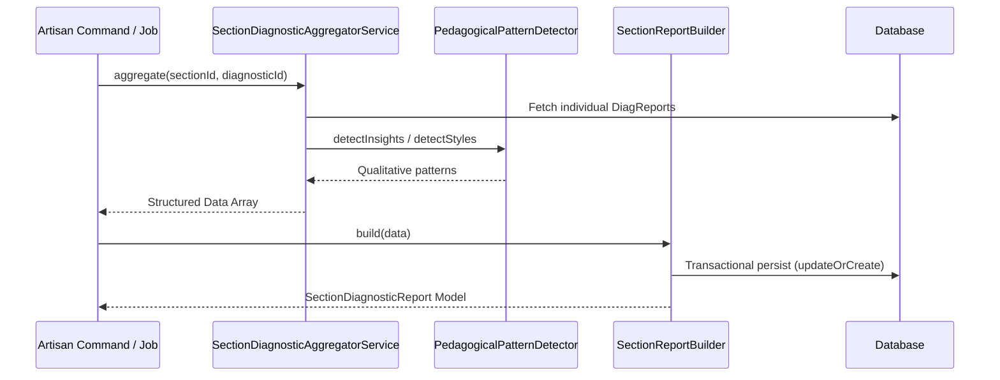

# Documentación Técnica — Sistema de Síntesis Diagnóstica por Sección

Esta documentación describe el funcionamiento técnico de los componentes implementados para generar informes pedagógicos a nivel de sección.

## 1. Flujo General de Procesamiento

El sistema sigue un pipeline de tres etapas: **Entrada (Comando/Job)** -> **Procesamiento/Agregación (Service)** -> **Persistencia (Builder)**.

---

## 2. Componentes Principales

### 2.1. Artisan Command: [GenerateSectionDiagnosticReportCommand](file:///home/nuser/code/s2526/app/Console/Commands/Diagnostic/GenerateSectionDiagnosticReportCommand.php#10-71)
Es el punto de entrada manual para administradores y desarrolladores.

*   **Firma:** `php artisan diagnostic:generate-section-report {section_id} {diagnostic_id} {--queue}`
*   **Responsabilidades:**
    *   Validar los argumentos de entrada.
    *   **Modo Síncrono:** Ejecuta el proceso inmediatamente y muestra una tabla resumen de los resultados en la consola.
    *   **Modo Asíncrono (`--queue`):** Despacha un Job a la cola para procesamiento en segundo plano, permitiendo continuar sin esperar.
    *   Proporcionar feedback visual (mensajes de éxito/error).

### 2.2. Servicio: [SectionDiagnosticAggregatorService](file:///home/nuser/code/s2526/app/Services/Diagnostic/Section/SectionDiagnosticAggregatorService.php#8-104)
Es el cerebro del sistema, encargado de transformar datos individuales en métricas grupales.

*   **Ubicación:** [app/Services/Diagnostic/Section/SectionDiagnosticAggregatorService.php](file:///home/nuser/code/s2526/app/Services/Diagnostic/Section/SectionDiagnosticAggregatorService.php)
*   **Lógica Interna:**
    1.  **Recolección:** Busca todos los [DiagReport](file:///home/nuser/code/s2526/app/Models/app/Instrument/DiagReport.php#9-73) que pertenezcan a estudiantes inscritos en la sección específica para el ciclo diagnóstico indicado.
    2.  **Métricas Globales:** Calcula el promedio de precisión grupal y el conteo de estudiantes evaluados.
    3.  **Métricas por Área:** Agrupa los resultados por materia (`pensum_id`) para calcular el promedio de precisión y la distribución de niveles por asignatura.
    4.  **Integración Cualitativa:** Utiliza el [PedagogicalPatternDetector](file:///home/nuser/code/s2526/app/Services/Diagnostic/Section/PedagogicalPatternDetector.php#7-63) para identificar estilos de aprendizaje dominantes y patrones de error comunes.

### 2.3. Servicio: [SectionReportBuilder](file:///home/nuser/code/s2526/app/Services/Diagnostic/Section/SectionReportBuilder.php#14-145)
Encargado de la integridad referencial y el almacenamiento de los resultados en la base de datos.

*   **Ubicación:** [app/Services/Diagnostic/Section/SectionReportBuilder.php](file:///home/nuser/code/s2526/app/Services/Diagnostic/Section/SectionReportBuilder.php)
*   **Características Clave:**
    *   **Atomicidad:** Todo el proceso ocurre dentro de una **transacción de base de datos**. Si falla la creación de un sub-componente (ej. Recomendaciones), no se guarda nada.
    *   **Idempotencia:** Utiliza `updateOrCreate`. Si se vuelve a ejecutar para la misma sección y diagnóstico, actualiza el informe existente en lugar de duplicarlo.
    *   **Estructura Jerárquica:** Crea el registro en `section_diagnostic_reports` y luego puebla automáticamente:
        *   `section_global_results` (Distribuciones y resúmenes).
        *   `section_area_results` (Resultados por materia).
        *   `section_profiles` (Fortalezas, necesidades y estilos).
        *   `section_contrasts` (Brechas).
        *   `section_recommendations` (Acciones sugeridas por actor).

---

## 3. Consideraciones Técnicas

*   **Rendimiento:** El proceso de agregación es intensivo en consultas. Por ello, se recomienda usar el flag `--queue` en producción para secciones grandes.
*   **Extensibilidad:** El [PedagogicalPatternDetector](file:///home/nuser/code/s2526/app/Services/Diagnostic/Section/PedagogicalPatternDetector.php#7-63) está diseñado para evolucionar. Actualmente detecta patrones simples, pero puede extenderse para análisis estadístico avanzado sin afectar la estructura de los servicios principales.
*   **Logging:** Todas las operaciones críticas (inicio, éxito, fallo) quedan registradas en los logs de Laravel a través del Job, facilitando la auditoría técnica.
